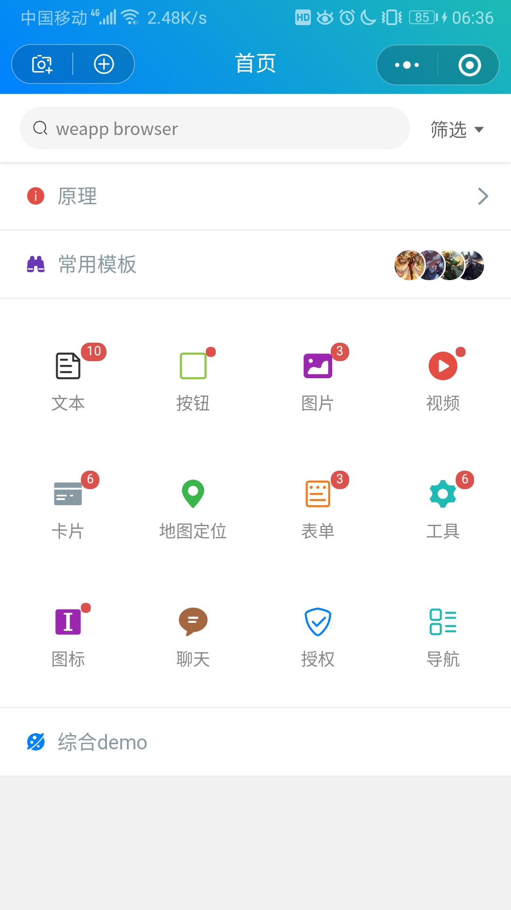

Welcome to the webrowser

### 目录结构

```sh
.
├─colorui      // colorui
├─libs         // 依赖库
│  ├─lru       // lru-map 缓存
│  ├─map       // map 地图定位js sdk
│  ├─net       // 微信小程序网络封装
│  └─diff      // object对比
├─pages
│  ├─common    // 封装Page，集成render模板组合事件方法
│  └─index     // 入口，wx:for 根据type，获取render.wxml的模板渲染页面，根据后台数据即可显示不同布局，demo是随机模拟不同组合
├─template
│  └─render    // 通用模板集合
└─utils
```

## 效果截图


### 引用及参考

- [ColorUi](https://github.com/weilanwl/ColorUI)
- [westore-diff](https://github.com/Tencent/westore#json-diff)

