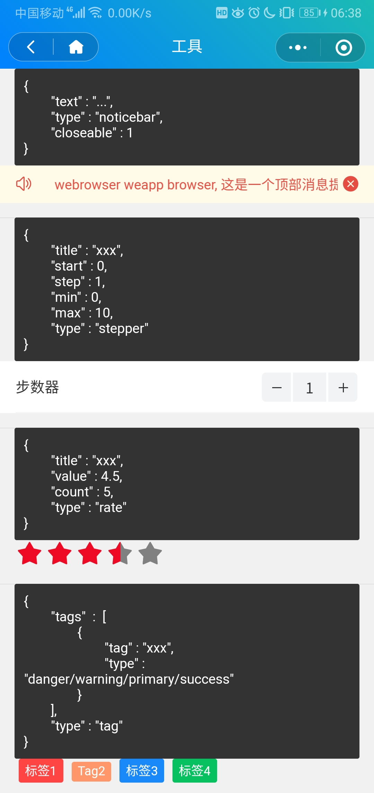

### 滚动通知栏

```js{
    text: "...",         // 内容
    type: "noticebar",
    color: "red",        // 颜色
    closeable: 1         // 是否可关闭
}
```

### 步数器

```js
{
    type: "stepper",
    title: "xxx",     // 标题
    start: 0,         // 其实值
    step: 1,          // 每次变更数量
    min: 0,           // 最小值
    max: 10,          // 最大值
}
```

### 点赞星级

```js
{
    type: "rate",
    title: "xxx",    // 标题
    value: 4.5,      // 当前星级值
    count: 5,        // 最大值
}
```

### 标签

```js
{
    tags: [
        {
            tag: "xxx",
            type: "danger/warning/primary/success" // 类型
        }
    ],
    type: "tag"
}
```