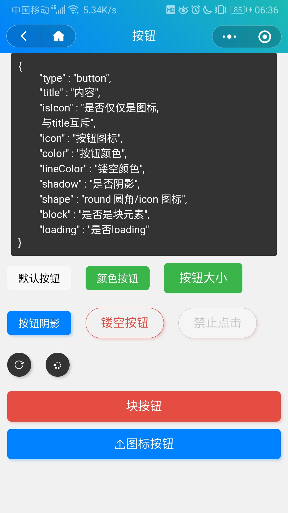

```js
{
    type: "button", 
    title: "内容",
    isIcon: "是否仅仅是图标, 与title互斥",
    icon: "按钮图标",
    color: "按钮颜色",
    lineColor: "镂空颜色",
    shadow: "是否阴影",
    shape: "round 圆角/icon 图标",
    block: "是否是块元素",
    loading: "是否loading" 
}
```