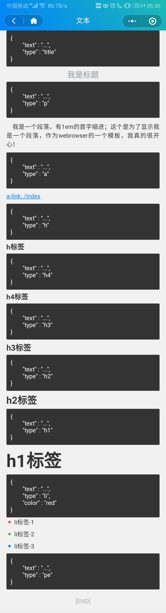

## 效果截图


### title 标题

```js
{
    text: "...",
    type: "title"
}
```
### p 段落
```js
{
    text: "...",
    type: "p" 
}
```
### a 链接
```js
{
    text: "...",
    type: "a",
    href: ''
}
```
### h ~ h4 标签
```js
{
    text: "...",
    type: "h" // h1 ~ h4
}
```

### li 
```js
{
    text: "...",
    color: "red",
    type: "li" // h1 ~ h4
}
```

### pe 段落结束标签
```js
{
    text: "...",
    type: "pe"
}
```