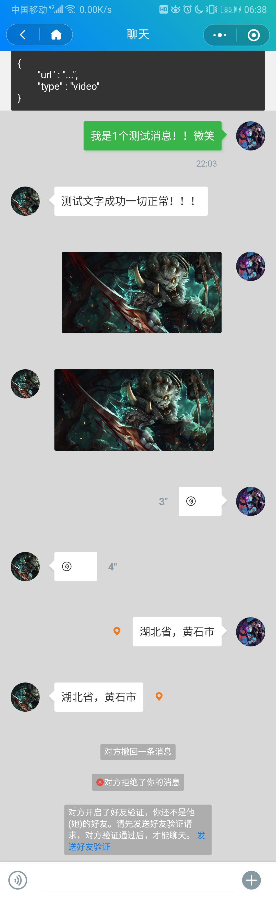

### 聊天
```js
  {
    type: "chat",
    list: [
        {
            id: '1',            // 记录id
            chat2Name: '马云',  // 对方名字
            name: 'skybosi',    // 发送者名字
            avatar: 'xxx',      // 头像
            from_type: 'self',  // self 自己发送 other 对方 info 提示信息
            msg_type: 'text',   // text 文本 sound 语音 image 图片 video 视频 location 位置
            summary: '内容',    // text、info 内容
            time: '22:03',      // 发送时间
        },
    ]
  }
```